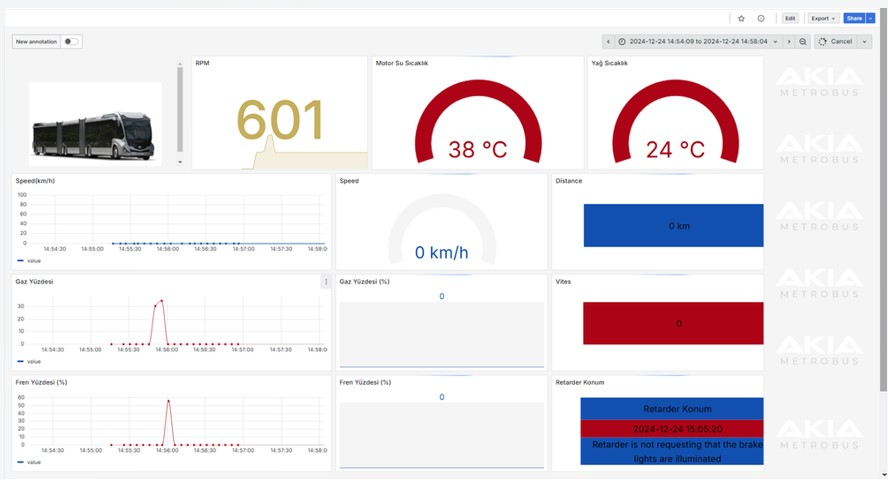
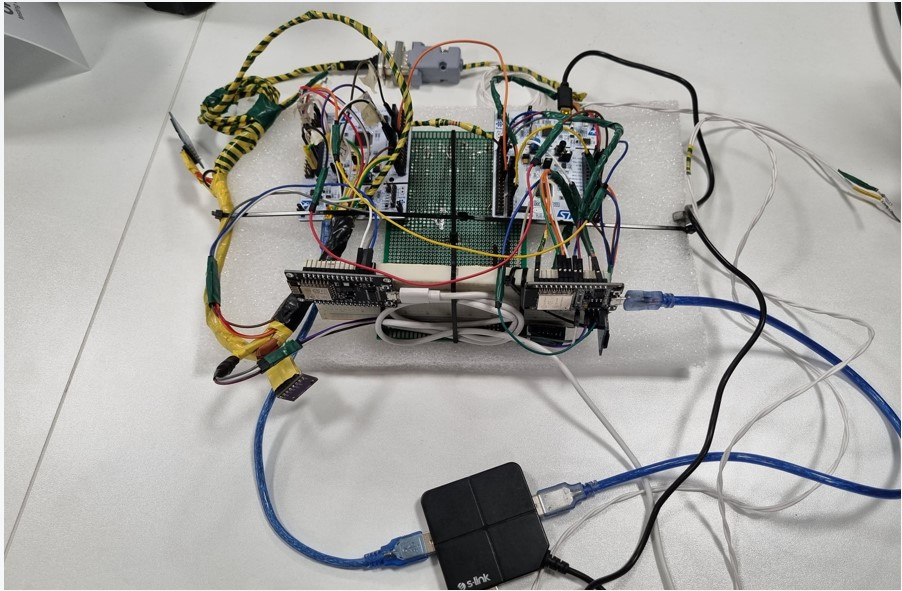

# 🚍 BusConnect – Server-Based Remote Monitoring, Telemetry, and Logging System

📌 About the Project

- BusConnect is a system designed to monitor, record, and visualize data obtained from the CAN bus of buses in both real-time and retrospective modes.
The project collects data from ECUs (Electronic Control Units) via STM32 microcontrollers, transfers it to AWS Cloud using ESP8266/ESP32 modules, and processes it with AWS Lambda, Athena, and Grafana for meaningful analysis and visualization.

With this system:
- Critical data can be monitored in real-time via a telemetry dashboard.
- ASC-format logs can be analyzed retrospectively.
- Cloud integration enables remote access to data from anywhere.

❓ Problem Definition

Using multiple third-party telemetry systems:
- Increases costs,
- Creates data security risks.
Solution: Develop a proprietary telemetry system

🎯 Project Objective

- Real-time monitoring of selected CAN bus signals
- Logging data every 2 seconds and sending it to AWS
- Recording data in ASC format for retrospective analysis
- Visualizing meaningful insights with Grafana

🔄 Workflow and System Architecture

1. Data Collection
- STM32 F303RE → Filters 9 messages, stores in SD card.
- STM32 F446RE → Logs all messages in ASC format.

2. Cloud Transfer
- ESP8266 → Sends real-time telemetry data.
- ESP32 → Sends historical data + ASC log files.

3. Data Transformation
- AWS Lambda → Converts JSON → CSV.
- Uses DBC files to decode and interpret data.

4. Analysis and Visualization
- AWS Athena → Converts processed data into queryable tables.
- Grafana → Real-time & retrospective visualization dashboards.

⚙️ Hardware Components
🔹 STM32 F303RE
- 72 MHz, 64 KB RAM
- Filters 9 CAN2 messages
- Stores data in CSV format on SD card
- Sends data in JSON format via UART to ESP modules

🔹 STM32 F446RE
- 180 MHz, 128 KB RAM
- Logs all CAN bus messages in ASC format
- Compatible with Vector CANalyzer
- Sends “STOP” signal to ESP32 for file upload

🔹 ESP8266
- Connects to AWS IoT Core via MQTT
- Communicates with STM32 F303RE over UART
-Sends telemetry data in JSON packets

🔹 ESP32
- Communicates with both STM32 boards
- Reads ASC files from SD card and uploads via HTTP
- Handles real-time and batch data transfer

☁️ AWS Services

- IoT Core → Collects data from ESP modules via MQTT
- S3 Bucket →
  - data/ → Real-time telemetry
  - csv/ → Retrospective data
  - asc/ → ASC logs
  - output/ → Decoded data

- Lambda Functions →
1. dbckod → Real-time decoding
2. canbusdata → Retrospective CSV logging
3. canbusdbc → Manual CSV decoding
4. ASC → ASC → CSV conversion
5. ASCdbc → Decoding ASC data with DBC

- Athena → Querying and tabular analysis

- Grafana → 4 dashboards:
  - BusConnect (Real-time)
  - Visualization (Historical data)
  - ASC Visualization
  - Logo Dashboard

📡 Protocols

- MQTT → For lightweight real-time telemetry
- HTTP → For ASC log file uploads
- Pub-Sub Model → Used with AWS IoT Core

🧪 Testing and Results
- Data successfully transferred to AWS.
- Critical parameters such as RPM and Brake Pedal Position monitored in real-time and historically.
- ASC files validated and analyzed with Vector CANalyzer.

✅ Advantages, Challenges & Solutions
Advantages
  - 🌍 Cloud integration
  - 📊 Strong visualization capabilities
  - 🔒 Secure with AWS certificates
  - 🔌 Easy hardware integration
  - 💰 Optimized operational costs

Challenges & Solutions

1. Data Accuracy → Solved with timestamping + SD backup
2. High Data Volume → Solved with microSD buffering and batching
3. Hardware Integration → UART, SPI, CAN protocols ensured smooth comms
4. Network Latency → Solved with dual storage (SD + Cloud sync)
5. Data Security → AWS IoT certificates & IAM policies

🚀 Future Plans
- Expand ECU integration
- Add GSM network support
- Predictive maintenance with Machine Learning
- Mobile application for user access

📷 Sample Results

